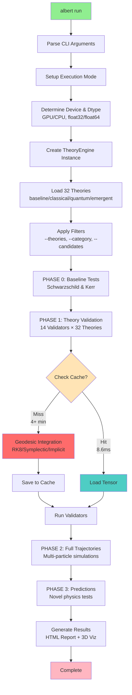
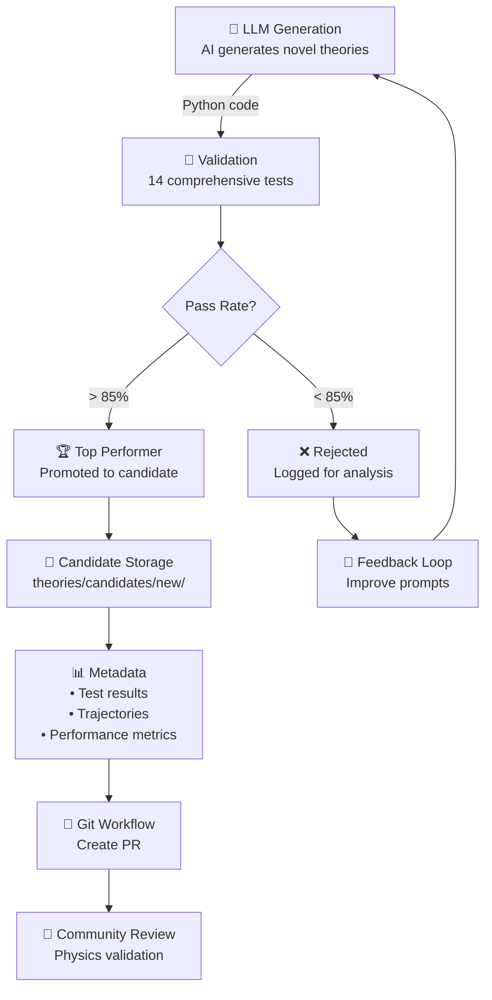
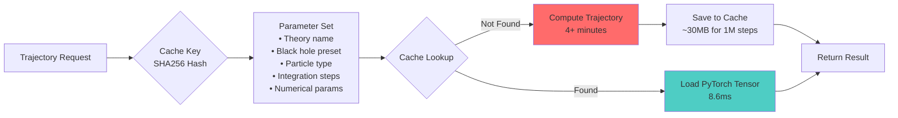

# 🌌 Albert: Physics at The Speed of AI

<div align="center">
  
  
 A highly experimental differential physics engine written in PyTorch with loosely defined physics. The core idea is that game engines tend to have baked in physics and then compute new solutions to problems within that search space (i.e. Newton or Rosetta). Albert inverses this by starting with observational data, validators (tests from publications across the internet that physicists have actually ran) and allowing for different systems defined by their Lagrangian to interact and compute differential values in the engine that can be used to learn deltas from observational results, which can be used to compute gradients and/or RL over many steps in a trajectory. It then tries to apply those to known problems and uncertainties to see if better predictions can be made. View an example report [here](https://albert.so/documentation.html) - on the site. As the engine matures, at a very high level, my long term vision is that people can run this in parallel, as a central list of expert problem identifiers (i.e. physicists) distribute search spaces in the engine via GitHub, inspired by [Rosetta@Home]([https://albert.so/documentation.html](https://en.wikipedia.org/wiki/Rosetta@home)). That's why I made it so easy to run in one line from the website etc!
  
  [](https://github.com/pimdewitte/albert)
  [](https://discord.gg/xdybbSk5)
  []()
  
</div>

---

## Setup

```bash
# One-line installation
curl -fsSL https://raw.githubusercontent.com/PimDeWitte/albert/refs/heads/main/download_cli.sh | bash

# Clone and setup
git clone https://github.com/pimdewitte/albert.git
cd albert
./setup_unified.sh

# Run all theories (standard run)
albert run

# Run with specific options
albert run --max-steps 100000
albert run --theories schwarzschild kerr
albert run --theories schwarzschild --black-hole-preset stellar_mass
albert run --category quantum

# Configure Albert (API keys, etc.)
albert setup

# Discover new theories automatically -- this is highly experimental and mostly just exists for fun - we don't have the observational data today to prove any of them ;) 
albert discover --initial "unified field theory"

# Discover variations of an existing theory
albert discover --from-theory theories/quantum_corrected

# Optional: Make albert available globally
sudo ln -s $(pwd)/albert /usr/local/bin/albert
# Now you can use 'albert' from anywhere
```

---

## CLI

### `albert run` - Run Theory Simulations
```bash
# Run all theories with default settings
albert run

# Run specific theories
albert run --theories schwarzschild kerr        # Multiple theories
albert run --category quantum                    # Run category
albert run --candidates                          # Include candidates

# Black hole configurations
albert run --black-hole-preset stellar_mass      # 10 solar masses
albert run --black-hole-preset primordial_mini   # Default: quantum scale
albert run --black-hole-preset sagittarius_a_star # Galactic center
albert run --black-hole-preset laboratory_micro  # Extreme quantum regime
albert run --black-hole-preset intermediate_mass # Globular clusters

# Particle simulations
albert run --particles electron photon neutrino  # Multi-particle
albert run --particles proton                    # Specific particle

# Performance options
albert run --device cuda --dtype float32         # GPU acceleration
albert run --device cpu --dtype float64          # Max precision
albert run --max-steps 1000000                   # Million-step trajectories
albert run --no-cache                            # Force recomputation (bypasses the tensor cache)
albert run --clear-cache                         # Clear cache and exit

# Advanced options
albert run --validators-only                     # Skip trajectory computation
albert run --max-parallel-workers 16             # Parallel processing
albert run --test                                # Run pre-flight tests
albert run --enable-sweeps                       # Enable parameter sweeps
albert run --sweep-only gamma                    # Sweep only specific parameter
albert run --experimental                        # Enable experimental quantum features
albert run --verbose                             # Enable verbose logging
albert run --final                               # High-quality publication mode
albert run --early-stop                          # Enable early stopping
albert run --quantum-field-content all           # Configure quantum field content
```

### `albert discover` - an experimental loop to test LLM generated theorems against observational data 
```bash
# Start discovery with default settings
albert discover

# Discovery with initial prompt
albert discover --initial "unified field theory with torsion"

# Improve existing theory
albert discover --from-theory theories/quantum_corrected

# Continuous monitoring mode
albert discover --self-monitor
```
The origination of this project was trying to identify the most likely candidates of Einstein's final bedside notes based on completions by various models. The test framework around it was built to validate generations. And the differential engine can provide feedback data. This loop is obviously highly speculative, experimental and so far hasn't produced anything of meaning :)

### `albert setup` - Configuration
```bash
# Interactive setup wizard
albert setup
```

### Other Commands
```bash
albert validate path/to/theory.py    # Validate specific theory
albert test                         # Run environment tests
albert --help                       # Show all commands
```

---


### Candidate Theory System
```
physics_agent/theories/candidates/
├── proposed/     # Theories awaiting review
├── new/          # Recently discovered theories
└── rejected/     # Theories that didn't pass validation
```

Every theory is referenced against publicly available observational data


---

## Implementing A New Theory

1. **Create theory file**: `theories/my_theory/theory.py`
2. **Define your metric**:
```python
from physics_agent.base_theory import GravitationalTheory, Tensor
import torch

class MyTheory(GravitationalTheory):
    def __init__(self):
        super().__init__(
            name="My Theory",
            description="Novel gravitational theory",
            category="quantum"  # or "classical", "emergent", "baseline"
        )
    
    def get_metric(self, r, M, C, G):
        # Define your g_μν components
        g_tt = -(1 - 2*G*M/(C**2 * r))
        g_rr = 1/(1 - 2*G*M/(C**2 * r))
        # ... define all components
        return Tensor("metric", [...])
```

3. **Run validation**:
```bash
albert run --theories "My Theory"
```
---

## 📚 Documentation

- [Introduction & System](docs/introduction.html) - Architecture overview
- [Solvers & Validators](docs/solvers_validators.html) - Testing framework
- [Cache System](docs/cache.html) - Performance optimization
- [API Reference](https://albert.so/documentation.html) - Full documentation

---

## 📊 Architecture Diagrams

### Theory Engine Core Execution Flow



### Self-Discovery Flow



### Cache Architecture



---

## Prerequisites

- **Python**: 3.9+
- **GPU**: NVIDIA (CUDA), Apple Silicon (MPS), or CPU fallback
- **API Key**: xAI/Grok (recommended) or experimental support for other providers

## Configuration

Albert uses AI to generate new theories. Get your API key:

### Primary Provider (Recommended)
- **xAI/Grok**: https://x.ai/api

### Experimental Providers
- OpenAI, Anthropic, Google Gemini (limited support)

Run the setup wizard:
```bash
albert setup
```

---

<div align="center">
  <i>"I want to know God's thoughts. The rest are details."</i><br>
  — Albert Einstein
</div>
